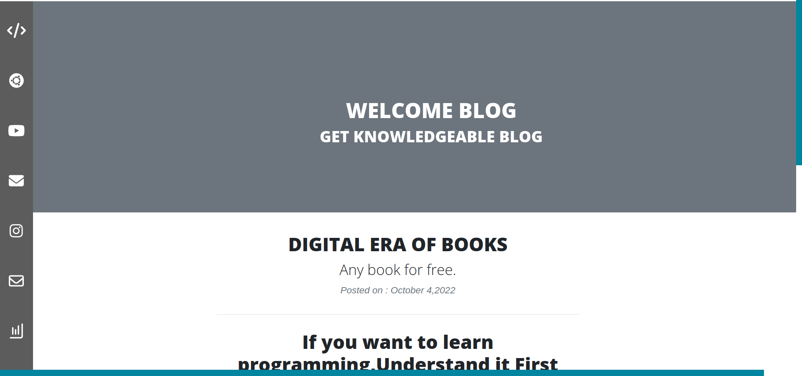
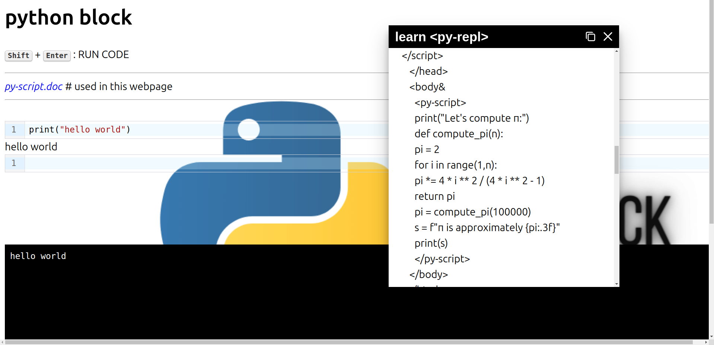
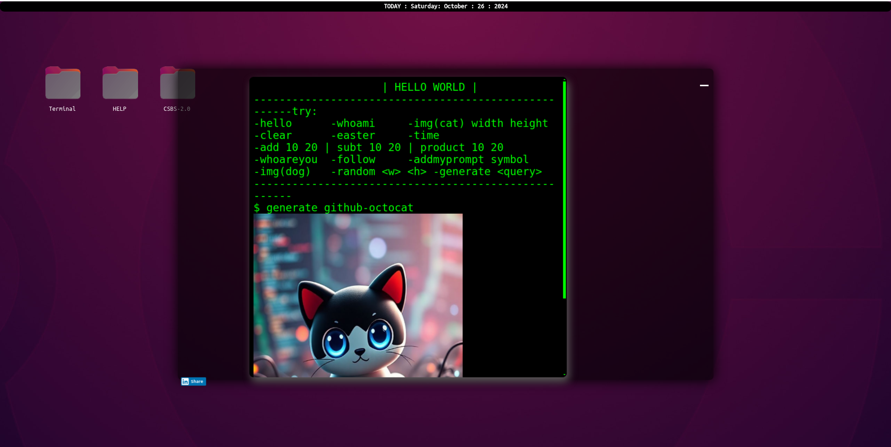
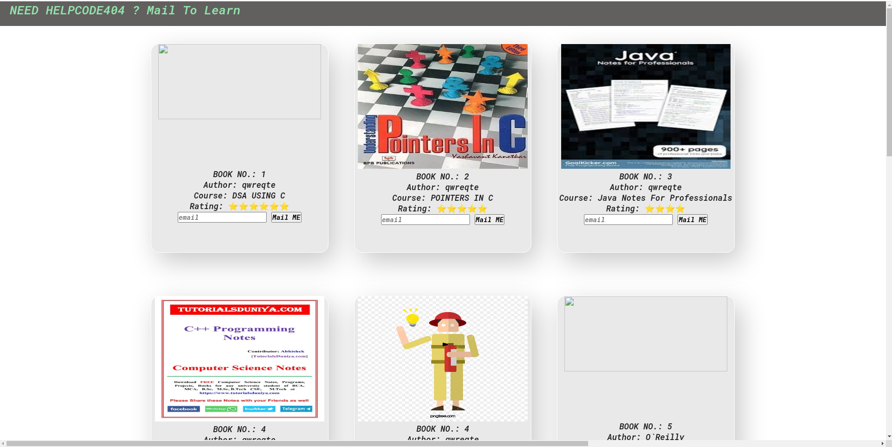
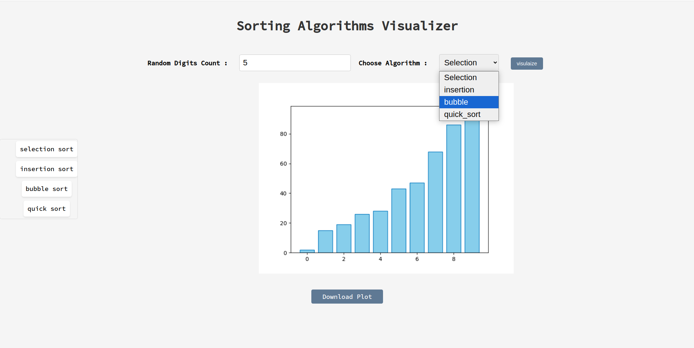

# CSBS 2.0 (now 4.0)

CSBS 2.0 is a Flask-based web application designed to provide an interactive platform for users to engage with various features. This project showcases the power of Flask in building dynamic web applications.


## Live Demo

You can access the live project at the following link: [CSBS 2.0  Live Demo](https://csbs20.up.railway.app/)

> if the above link is not wokring, check [backup](https://csbs40.onrender.com/)


## Screenshots of few Pages






## Installation
To run this project locally, you can either use a virtual environment or Docker.

### Option 1: Local Installation
- Clone the repository:

    ```bash
    git clone https://github.com/Ronak-Ronu/csbs2.0.git
    ```
- Navigate to the project directory:

    ```bash
    cd csbs2.0
    ```
- Create a virtual environment:
    ```bash
    python -m venv venv
    ```
- Activate the virtual environment:
    - On Windows:
        ```bash
        venv\Scripts\activate   
        ```
    - On macOS/Linux:
        ```bash
        source venv/bin/activate
        ```
- Install the required packages:
```bash
pip install -r requirements.txt
```
- Run the application:
```bash
python app.py
```

### Option 2: Running with Docker
- Ensure you have Docker installed on your machine.
- Build the Docker image:
    ```bash
    docker build -t csbs2.0 .
    ```
- Run the Docker container:
    ```bash
    docker run -p 5000:5000 csbs2.0
    ```
- Access the application in your web browser at http://127.0.0.1:5000/.

#### Usage
- Open your web browser and go to http://127.0.0.1:5000/ to view the application.

